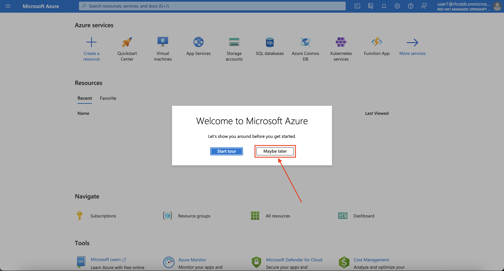
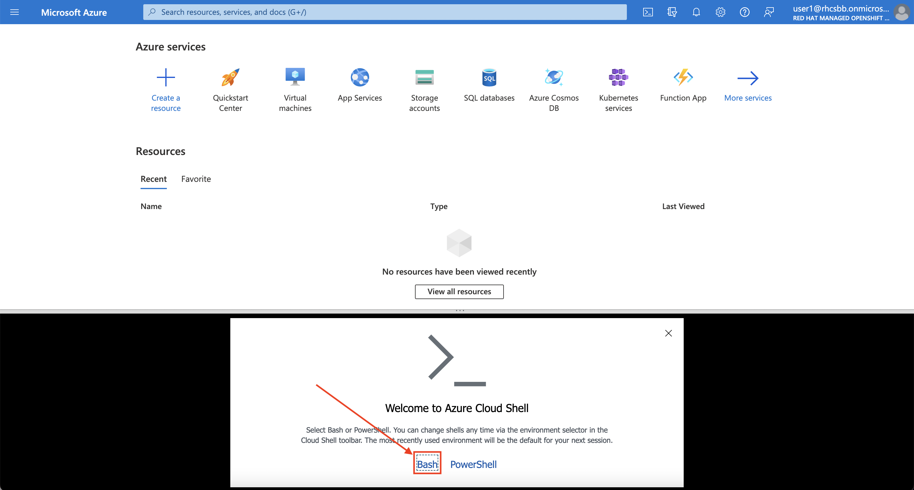
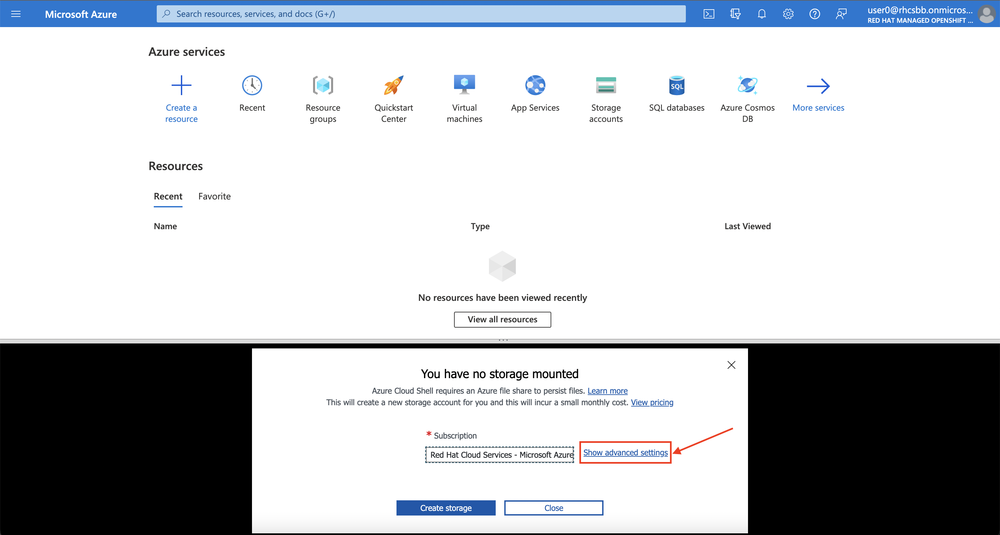
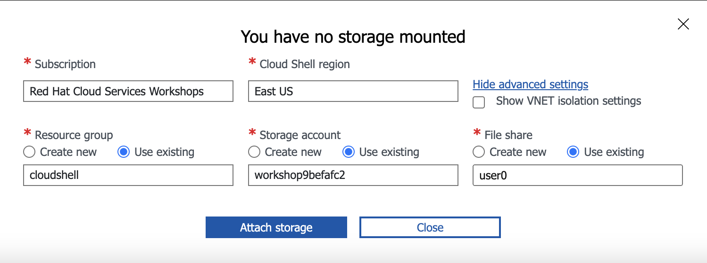

## The Workshop Environment You Are Using

Your workshop environment consists of several components which have been pre-configured and are ready to use. This includes a [Microsoft Azure](https://azure.microsoft.com/en-us/){:target="_blank"} account, an [Azure Red Hat OpenShift](https://azure.microsoft.com/en-us/products/openshift/){:target="_blank"} cluster, and many other supporting resources.

To access your working environment, you'll need to log into the [Microsoft Azure portal](https://portal.azure.com){:target="_blank"}.  Use your provided username with `@rhcsbb.onmicrosoft.com`. If you use the Azure portal regularly and it already knows a set of credentials for you, it's probably a good idea to use an Incognito window for this task, it should obviate the need to log out of an existing session.

When prompted, you'll log in with the credentials provided by the workshop team.

!!! warning "Log out of existing Microsoft Azure sessions"

    While these commands can be run in any Microsoft Azure account, we've completed many of the prerequisites for you to ensure they work in the workshop environment. As such, we recommend ensuring that you are logged out of any other Microsoft Azure sessions.

### Pre-created Resources

- Resource Group
<!--- vNet (with two subnets)
- Azure Red Hat OpenShift Cluster -->
- Azure AD Service Principal
- Azure DNS Zone

### Access Azure Cloud Shell

Azure Cloud Shell is an interactive, authenticated, browser-accessible shell for managing Azure resources. In this workshop, we'll use Azure Cloud Shell extensively to execute commands.

1. First, go ahead and skip the tour of the Azure Portal by clicking the *Maybe Later* button.

    { align=center }

1. To start Azure Cloud Shell, click on the `>_` button at the top right corner of the Azure Portal.

    { align=center }

1. Once prompted, select *Bash* from the *Welcome* screen.

    { align=center }

1. On the next screen, you'll receive a message that says "You have no storage mounted". Select the *Show advanced settings* link.

    { align=center }

1. While we've pre-created a number of resources, including a storage account for you to use with Azure Cloud Shell, you'll need to configure Azure Cloud Shell using the table below.

    | Option     | Value                               | Example |
    | ----------- | ------------------------------------ | -------- |
    | Subscription       | **Red Hat Cloud Services Workshops**  | N/A |
    | Cloud Shell region       | **East US**                 | N/A |
    | Show VNET isolation settings    | *Leave Unchecked* | N/A |
    | Resource group       | **user#_mobbws-rg** (Select *Use Existing* Button) | **user2_mobbws-rg** |
    | Storage account       | **user#mobbws** (Select *Use Existing* Button) | **user2mobbws** |
    | File share       | **acs** (Select *Use Existing* Button) | **acs** |

1. Once completed, click on the *Attach Storage* button to start your Azure Cloud Shell session.

    { align=center }

1. When your shell is ready and you are at the bash prompt, run the following command to prepare your Cloud Shell environment for the remainder of the workshop:

    ```bash
    ./clouddrive/setup.sh
    source ~/.workshoprc
    ```

    You will see a significant amount of output as the script prepares your environment for the workshop.

    Congratulations, your Azure Cloud Shell is now configured and you're ready to move on to the next page.

> Note: If you are familiar with tmux and its shortcuts, it would be a good idea to run `tmux` now so that if the Azure Cloud Console times out you can easily connect back to the tmux and retain your working session.
