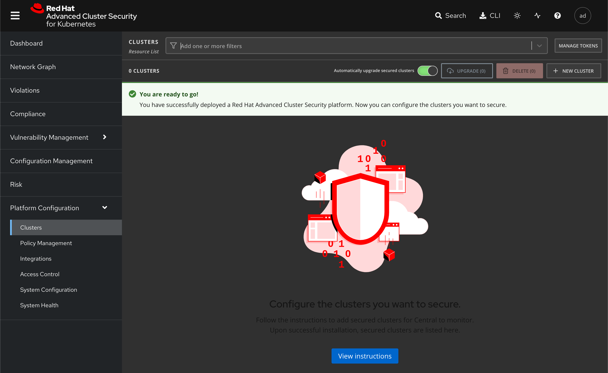
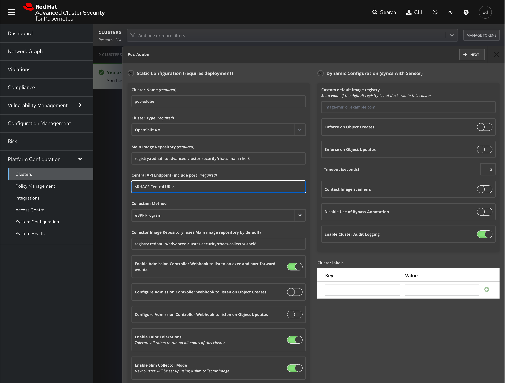
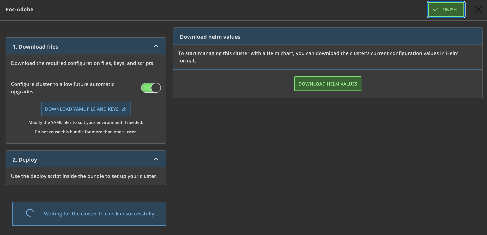
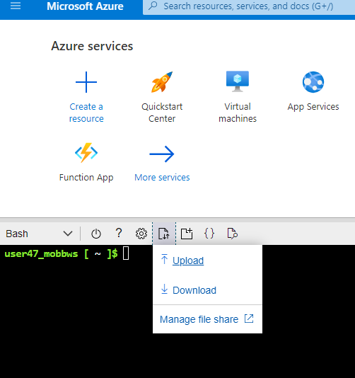

## Cluster ACS Registration

Red Hat Advanced Cluster Security for Kubernetes (Red Hat Advanced Cluster Security or RHACS) provides the tools and capabilities to address the security needs of a cloud-native development approach on Kubernetes.

The RHACS solution offers visibility into the security of your cluster, vulnerability management, and security compliance through auditing, network segmentation awareness and configuration, security risk profiling, security-related configuration management, threat detection, and incident response. In addition, RHACS grants an ability to pull the actions from that tooling deep into the application code development process through APIs.
These security features represent the primary work any developer or administrator faces as they work across a range of environments, including multiple datacenters, private clouds, or public clouds that run Kubernetes clusters.

## Pre-requisites

In order to make use of RHACS, you'll need the following:

1. A primary RHACS instance ("Central" in RHACS nomenclature), which will be pre-provisioned for this workshop
1. A working set of `admin` credentials on the cluster you wish to add to ACS, which should already be available in your `kubeconfig` as part of earlier workshop activities
1. The `helm` CLI client, which is one of the tools pre-installed in your Cloud Shell
1. The `rhacs` Helm repo added to the local configuration with the following command:
    ```bash
    helm repo add rhacs https://mirror.openshift.com/pub/rhacs/charts/
    ```
1. The common `init bundle` provided by RHACS that contains certificates to secure communication between the cluster and the Central instance. In the workshop, this should be in the home directory in Cloud Shell already. It will be passed as a parameter to `helm` on install.

## Configure the Central instance

The first step is to tell the Central instance that it has another cluster to manage. RHACS has it's own web console that it provides, and the URL for it should be provided by your workshop facilitators.

The RHACS Central instance is configured to use SSO, so the Azure credentials that are used for the workshop should automatically get you into the console with `Admin` credentials.

1. Log into the ACS Central Instance

    ```
    https://central-rhacs-operator.apps.poc-adobe-acs.5fge.p1.openshiftapps.com
    ```

The admin interface looks like this: 

1. On the left-hand menu, there's an item labelled 'Platform Configuration' and then there's a sub-menu item labelled 'Clusters' that needs to be selected.



1. On this screen, there's a button on the top right that says '+ New Cluster' which opens a dialog that we'll follow.

1. There are only three **required** values to configure in this dialog: The 'Cluster Name', 'Central API Endpoint' (which must include a port number), and 'Cluster Type' fields need to be populated. The cluster name should match the name of the cluster that was built earlier in the workshop, and the Central API URL is the same as the one used to get into the ACS console, with the addition of the explicit port number at the end:

    ```
    https://central-rhacs-operator.apps.poc-adobe-acs.5fge.p1.openshiftapps.com:443
    ```

The 'Cluster Type' should be set to 'OpenShift 4.x' for purposes of the workshop, though RHACS will also managed OCP 3.x and plain Kubernetes installs as well.

1. When those values have been configured, click the 'Next' button at the top of the page. RHACS will then present a page that gives a couple of options for actually configuring the target cluster with the RHACS services: Raw YAML or a Helm values file.

    

1. Download the Helm values file locally, and then use the 'Upload Files' button in Cloud Shell so it's available there.

    

1. When the file is uploaded, run the following command to launch the Helm chart:

    ```bash
    helm install -n stackrox --create-namespace stackrox-secured-cluster-services \
      rhacs/secured-cluster-services \
      -f clouddrive/adobe-workshop-cluster-init-bundle.yaml \
      -f <downloaded_helm_values_file>

    ```

1. This will create a number of resources on the target cluster in relatively short order. The RHACS console may or may not immediately update indicating that the target cluster is reporting, so the first step in validation is to run an `oc` command in Cloud Shell:

    ```bash
    oc -n stackrox get pod -w
    ```

The output should indicate that three distinct types of Pod are running:

- Admission controller
- Sensor
- Collector

There will only be one `sensor` Pod, three `admission-control` Pods (one per master node), and a `collector` Pod for every node regardless of type (9 on a standard multi-AZ ROSA cluster, 6 on a standard ARO cluster).


When the Pods are all started and stable, it may be necessary to refresh the page on the RHACS console, but the 'Cluster Status' should now show 'Healthy' with a detail of each component type underneath.


