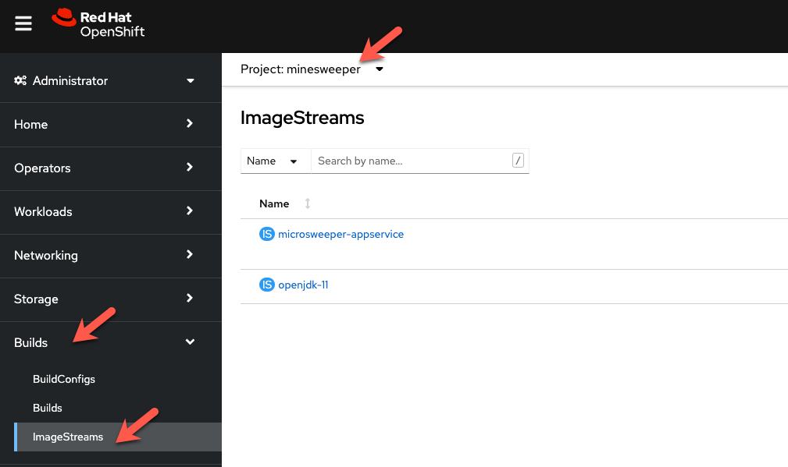
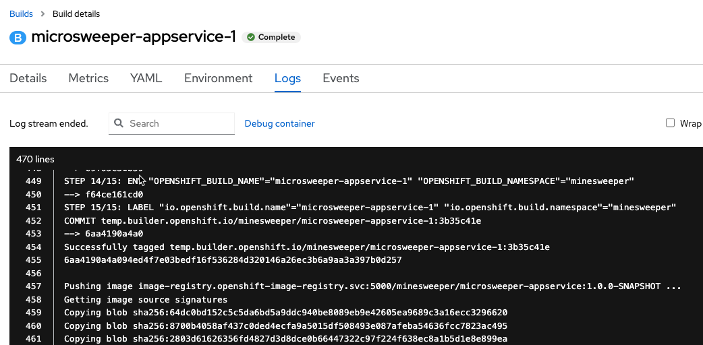
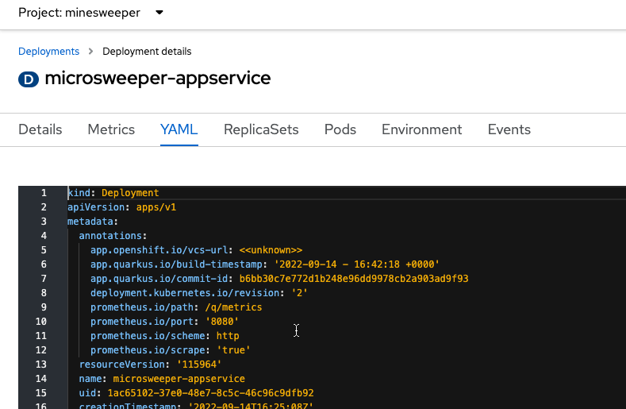
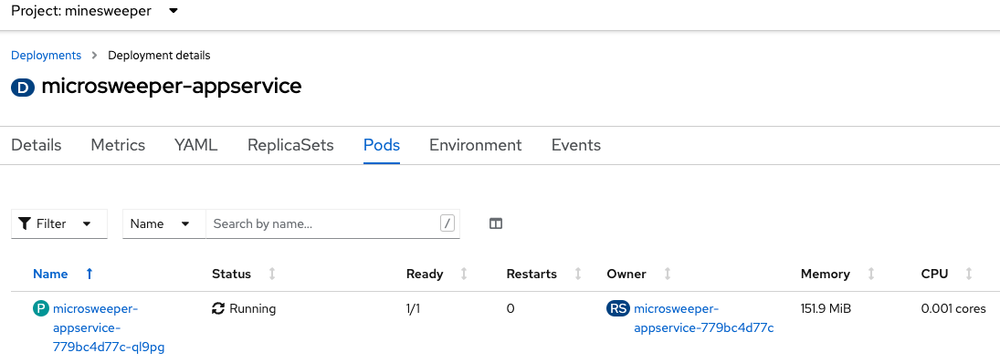
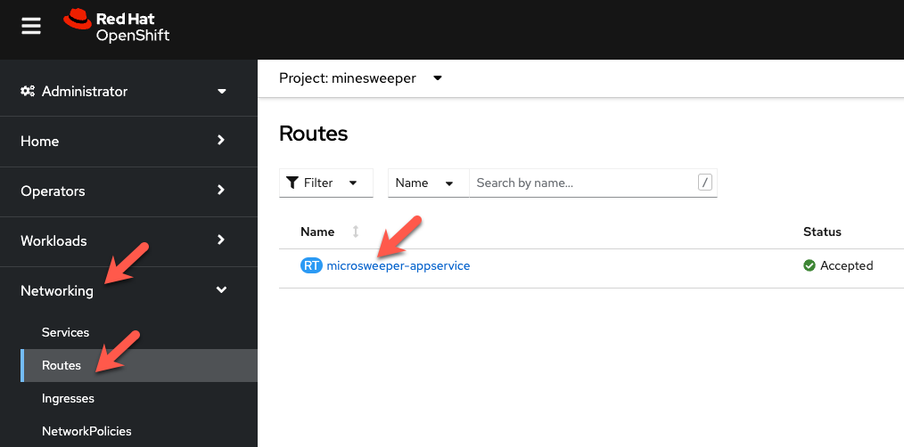
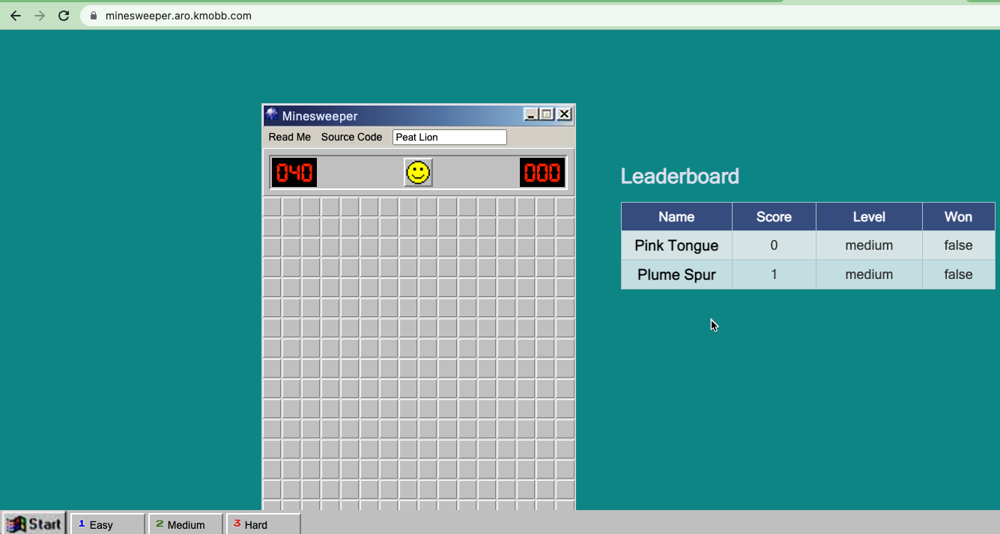
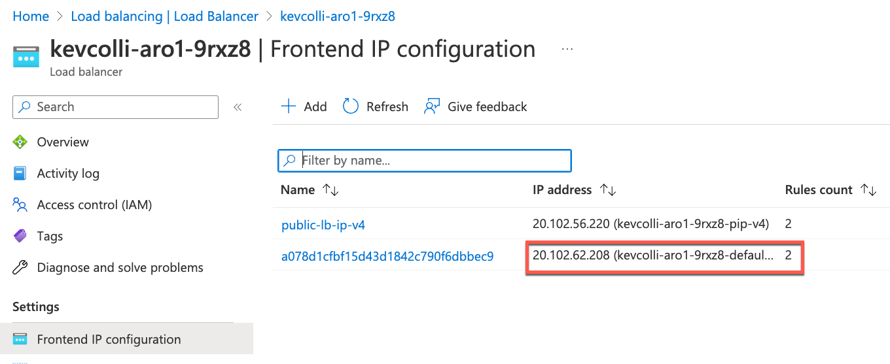
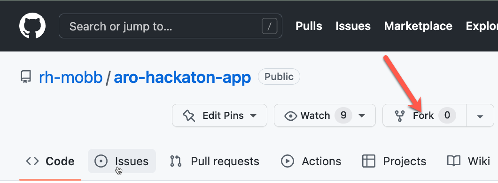
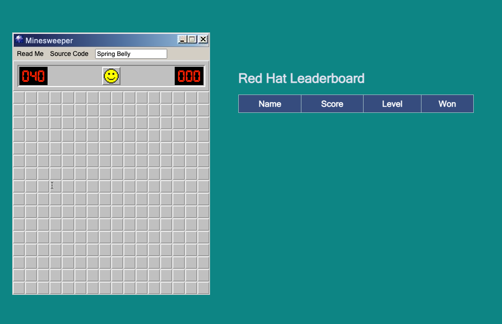

# Deploy and Expose an Application
Securing exposing an Internet facing application with an ARO Cluster.

When you create a cluster on ARO you have several options in making the cluster public or private. With a public cluster you are allowing Internet traffic to the api and *.apps endpoints. With a private cluster you can make either or both the api and .apps endpoints private.

How can you allow Internet access to an application running on your private cluster where the .apps endpoint is private? This document will guide you through using Azure Frontdoor to expose your applications to the Internet. There are several advantages of this approach, namely your cluster and all the resources in your Azure account can remain private, providing you an extra layer of security. Azure FrontDoor operates at the edge so we are controlling traffic before it even gets into your Azure account. On top of that, Azure FrontDoor also offers WAF and DDoS protection, certificate management and SSL Offloading just to name a few benefits.

!!! note 

    In this workshop we are using public clusters to simplify connectity to the environment.  Even though we are using a public cluster, the same methodology applies to expose an application to the Internet from a private cluster.  To similate a private cluster, we will be creating a 2nd private Ingress Controller.

## Prerequisites
* a unique USER ID
* Azure Database for PostgreSQL
* Azure Container Registry Instance and Password
* A public GitHub id ( only required for the 'Automate Deploying the App' )
<br>

## Deploy an application
Now the fun part, let's deploy an application!  
We will be deploying a Java based application called [microsweeper](https://github.com/redhat-mw-demos/microsweeper-quarkus/tree/ARO).  This is an application that runs on OpenShift and uses a PostgreSQL database to store scores.  With ARO being a first class service on Azure, we will create an Azure Database for PostgreSQL service and connect it to our cluster with a private endpoint.

Prerequisites - this part of the workshop assumes you have already created a Azure Database for PostgreSQL database named <USERID>-microsweeper-database that you created and configured in a previous step.

!!! note
    
    Throughout this tutorial, we will be distinguishing your application and resources based on a USERID assigned to you.  Please see a facilitator if they have not given you a USER ID.

From the Azure Cloud Shell, set an environment variable for your user id and the Azure Resource Group given to you by the facilitor:

```bash
export USERID=<The user ID a facilitator gave you>
export ARORG=<The Azure Resource Group a facilitator gave you>
export ARO_APP_FQDN=minesweeper.$USERID.azure.mobb.ninja
```

1.  **Clone the git repository** 

  The first thing we need to do is get a copy of the code that we will build and deploy to our clusters.  

   ```bash
   git clone https://github.com/rh-mobb/aro-hackaton-app
   ```

2.  **Change to the root directory**

   ```bash
   cd aro-hackaton-app
   ```


3.  **Log into your openshift cluster with Azure Cloud Shell**

4.  **Switch to your OpenShift Project**

   ```bash
   oc project <USER ID>
   ```
  
  !!! info
      
      As part of the workshop setup, an OpenShift project has been created using your USERID as the name of the project

5. **Add the OpenShift extension to quarkus**

   ```bash
   quarkus ext add openshift
   ```

6. **Edit aro-hackaton-app/src/main/resources/application.properties**

   Make sure your file looks like the one below, changing the following lines:
  
  - **%prod.quarkus.datasource.jdbc.url=jdbc:postgresql://<USERID>-minesweeper-database:5432/score** <br>
    Change the above line with your USERID for the database that has been configured for you:
  
  !!! info
  
      Note the options in OpenShift Configurations.
      - **%prod.quarkus.openshift.deployment-kind=Deployment** <br>
        We will be creating a deployment for the application. 
      - **%prod.quarkus.openshift.build-strategy=docker** <br>
        The application will be built uisng Docker.
      - **%prod.quarkus.container-image.group=minesweeper** <br>
        The application will use the namespace your facilitator assigned to you.
      - **%prod.quarkus.openshift.expose=true** <br>
        We will expose the route using the default openshift router domain - apps.\<cluster-id\>.eastus.aroapp.io

   Sample microsweeper-quarkus/src/main/resources/application.properties

   ```
   # Database configurations
   %prod.quarkus.datasource.db-kind=postgresql
   %prod.quarkus.datasource.jdbc.url=jdbc:postgresql://<USERID>-minesweeper-database:5432/score
   %prod.quarkus.datasource.jdbc.driver=org.postgresql.Driver
   %prod.quarkus.datasource.username=quarkus
   %prod.quarkus.datasource.password=r3dh4t1!
   %prod.quarkus.hibernate-orm.database.generation=drop-and-create
   %prod.quarkus.hibernate-orm.database.generation=update

   # OpenShift configurations
   %prod.quarkus.kubernetes-client.trust-certs=true
   %prod.quarkus.kubernetes.deploy=true
   %prod.quarkus.kubernetes.deployment-target=openshift
   #%prod.quarkus.kubernetes.deployment-target=knative
   %prod.quarkus.openshift.build-strategy=docker
   %prod.quarkus.openshift.expose=true
   %prod.quarkus.openshift.deployment-kind=Deployment
   %prod.quarkus.container-image.group=<CHANGE TO YOUR NAMESPACE>

   # Serverless configurations
   #%prod.quarkus.container-image.group=microsweeper-%prod.quarkus
   #%prod.quarkus.container-image.registry=image-registry.openshift-image-registry.svc:5000

   # macOS configurations
   #%prod.quarkus.native.container-build=true
   ```

   


1. Build and deploy the quarkus application to OpenShift.  One of the great things about OpenShift is the concept of Source to Image, where you simply point to your source code and OpenShift will build and deploy your application.  

In this first example, we will be using source to image and build configs that come built in with Quarkus and OpenShift.  To start the build ( and deploy ) process simply run the following command.

   ```bash
   quarkus build --no-tests
   ```

Let's take a look at what this did along with everything that was created in your cluster.

### Container Images
Log into the OpenShift Console and from the Administrator perspective, expand Builds and then Image Streams, and select the minesweeper Project.



You will see two images that were created on your behalf when you ran the quarkus build command.  There is one for openjdk-11 that comes with OpenShift as a Universal Base Image (UBI) that the application will run under. With UBI, you get highly optimized and secure container images that you can build your applications with.   For more information on UBI please read this [article](https://www.redhat.com/en/blog/introducing-red-hat-universal-base-image)

The second image you see is the the microsweeper-appservice image.  This is the image for the application that was build automatically for you and pushed to the container registry that comes with OpenShift.

### Image Build
How did those images get built you ask?   Back on the OpenShift Console, click on Build Configs and then the microsweeper-appservice entry.


When you ran the quarkus build command, this created the build config you can see here.  In our quarkus settings, we set the deployment strategy to build the image using Docker.  The Dockerfile file from the git repo that we cloned ~/microsweeper-quarkus/Dockerfile was used for this Build Config.  

```
A build configuration describes a single build definition and a set of triggers for when a new build is created. Build configurations are defined by a BuildConfig, which is a REST object that can be used in a POST to the API server to create a new instance.
```
You can read more about BuildConfigs [here](https://docs.openshift.com/container-platform/4.11/cicd/builds/understanding-buildconfigs.html)

Once the BuildConfig was created, the source to image process kicked off a Build of that build config.  The build is what actually does the work in building and deploying the image.  We started with defining what to be built with the BuildConfig and then actually did the work with the Build.
You can read more about Builds [here](https://docs.openshift.com/container-platform/4.11/cicd/builds/understanding-image-builds.html)

To look at what the build actually did, click on Builds tab and then into the first Build in the list.


On the next screen, explore around and look at the YAML definition of the build, Logs to see what the build actually did.  If you build failed for some reason, logs is a great first place to start to look at to debug what happened.


### Image Deployment
After the image was built, the S2I process then deployed the application for us.  In the quarkus properties file, we specified that a deployment should be created.  You can view the deployment under Workloads, Deployments, and then click on the Deployment name.


Explore around the deployment screen, check out the different tabs, look at the YAML that was created.


Look at the pod the deployment created, and see that it is running.


The last thing we will look at is the Route that was created for our application.  In the quarkus properties file, we specified that the application should be exposed to the Internet.  When you create a Route, you have the option to specify a hostname.  To start with, we will just use the default domain that comes with ARO.  In next section, we will expose the same appplication to a custom domain leveraging Azure Front Door.

You can read more about Routes [here](https://docs.openshift.com/container-platform/4.11/networking/routes/route-configuration.html)

From the OpenShift menu, click on Networking, Routes, and the microsweeper-appservice route.



## Test the application
While in the Route section of the OpenShift UI, click the url under location:


You can also get the the url for your application using the command line:
```bash
oc get routes -o json | jq -r '.items[0].spec.host'
```

Point your browser to the application!!


### Application IP 
Let's take a quick look at what IP the application resolves to.  Back in your Cloud Shell environment, run
```bash
nslookup <route host name>

i.e. nslookup microsweeper-appservice-minesweeper.apps.fiehcjr1.eastus.aroapp.io
```
Note: you can get the host name with:
```bash
oc get routes -o json | jq -r '.items[0].spec.host'
```
You should see results like the following:


Notice the IP address - can you guess where it comes from?

It comes from the ARO Load Balancer.  In this workshop, we are using a Public Cluster which means the load balancer is exposed to the Internet.  If this was a private cluster, you would have to have connectivity to the VNET ARO is running on whether that be VPN, Express Route, or something else.

To view the ARO load balancer, on the Azure Portal, Search for 'Load Balancers' and click on the Load balancers service.


Scroll down the list of load balancers until you see the one with your cluster name.  You will notice two load balancers, one that has -internal in the name and one that does not.  The '*-internal' load balancer is used for the OpenShift API.  The other load balancer ( without -internal ) in the name is used for applications.  Click into the load balancer for applications.


On the next screen, click on Frontend IP configuration.  Notice the IP address of the 2nd load balancer on the list.  This IP address matches what you found with the nslookup command.


For the fun of it, we can also look at what backends this load balancer is connected to. Click into the 2nd load balancer on the list above, and then click into the first rule.


On the next screen, notice the Backend pool.  This is the subnet that contains all the workers.  And the best part is all of this came with OpenShift and ARO!


## Expose the application with Front Door
Up to this point, we have deployed the minesweeper app using the publically available Ingress Controller that comes with OpenShift.  Best practices for ARO clusters is to make them private ( both the api server and the ingress controller) and then exposing the application you need with something like Azure Front Door.

In the following section of the workshop, we will go through setting up Azure Front Door and then exposing our minesweeper application with Azure Front Door using a custom domain.

The following diagram shows what we will configure.


There are several advantages of this approach, namely your cluster and all the resources in your Azure account can remain private, providing you an extra layer of security. Azure FrontDoor operates at the edge so we are controlling traffic before it even gets into your Azure account. On top of that, Azure FrontDoor also offers WAF and DDoS protection, certificate management and SSL Offloading just to name a few benefits.

As you can see in the diagram, Azure Front Door sits on the edge of the Microsoft network and is connected to the cluster via a private link service.  With a private cluster, this means all traffic goes through Front Door and is secured at the edge.  Front Door is then connected to your cluster through a private connection over the Microsoft backbone.

Setting up and configuring Azure Front Door for the minesweeper application is typically something the operations team would do.  If you are interested in going through the steps, you can do so [here](../ops/6-front-door.md)  


## Configure the application to use Front Door
Now that front door has been configured and we have a custom domain pointing to our application, we can now configure the application to use Azure Front Door and your custom domain.

The first thing we need to do is delete the route that is connecting directly to our cluster.

```bash
oc delete route microsweeper-appservice
```

Next, we create a new route that points to our application.

Create new route

```bash
cat << EOF | oc apply -f -
apiVersion: route.openshift.io/v1
kind: Route
metadata:
  labels:
    app.kubernetes.io/name: microsweeper-appservice
    app.kubernetes.io/version: 1.0.0-SNAPSHOT
    app.openshift.io/runtime: quarkus
    type: private
  name: microsweeper-appservice-fd
spec:
  host: $ARO_APP_FQDN
  to:
    kind: Service
    name: microsweeper-appservice
    weight: 100
    targetPort:
      port: 8080
  wildcardPolicy: None
EOF
```

# TODO - screen shots to show nslookup points to the edge

# Automate deploying the application with OpenShift Pipelines

We will be using OpenShift Pipelines which is based on the Open Source Tekton project to automatically deploy our application using a CI/CD pipeline.
 
If you would like to read more about OpenShift Pipelines, click [here](https://docs.openshift.com/container-platform/4.11/cicd/pipelines/understanding-openshift-pipelines.html)

The first thing you need to do is fork the code repositories so that you can make changes to the code base and then OpenShift pipelines will build and deploy the new code.

Opening your browser, go to the following github repos 
https://github.com/rh-mobb/common-java-dependencies
https://github.com/rh-mobb/aro-hackaton-app

For each of the repositories, click Fork and then choose your own Git Account.


Next, we will need to make a directory and clone your personal github repository that you just forked to.

```bash
mkdir $USERID
cd $USERID
git clone https://github.com/<YOUR GITHUB USER ID>/common-java-dependencies
git clone https://github.com/kmcolli/aro-hackaton-app

The next thing we need to do is import common Tekton tasks that our pipeline will use.  These common tasks are designed to be reused across multiple pipelines.

Let's start by taking a look at the reusable Tasks that we will be using.  From your cloud shell, change directorys to ~/aro-hackaton-app/pipeline and list the files.

```bash
cd ~/aro-hackaton-app/pipeline/tasks
ls | tr “” “\n”
```

Expected output:<br>


**1-git-clone.yaml** <br>
Clones a given GitHub Repo.

**2-mvn.yaml** <br>
This Task can be used to run a Maven build

**3-mvn-build-image.yaml** <br>
Packages source with maven builds and into a container image, then pushes it to a container registry. Builds source into a container image using Project Atomic's Buildah build tool. It uses Buildah's support for building from Dockerfiles, using its buildah bud command.This command executes the directives in the Dockerfile to assemble a container image, then pushes that image to a container registry.

**4-apply-manifest.yaml** <br>
Applied manifest files to the cluster

**5-update-deployment.yaml** <br>
Updates a deployment with the new container image.

From the Cloud Shell, we need to apply all of these tasks to our cluster.  Run the following command:

```bash
oc apply -f ~/aro-hackaton-app/pipeline/tasks
``` 

expected output:


Next, we need to create a secret to push and pull images into Azure Container Registry.  Each attendee has their own Azure Container Registry service assigned to them, with the naming convention <USERID>acr.azurecr.io

```bash
ACRPWD=$(az acr credential show -n ${USERID}acr -g $ARORG --query 'passwords[0].value' -o tsv)

oc create secret docker-registry --docker-server=${USERID}acr.azurecr.io --docker-username=${USERID}acr --docker-password=$ACRPWD --docker-email=unused acr-secret
```

Create the pipeline service account and permissions that the pipeline tasks will run under:

```bash
oc create -f ~/aro-hackaton-app/pipeline/1-pipeline-account.yaml
```

Expected output:


Link the acr-secret you just created to it can mount and pull images

```bash
oc secrets link pipeline acr-secret --for=pull,mount
```

Make sure the secret is linked to the pipeline service account.

```bash
oc describe sa pipeline
```

expected output: 


We also need to give the pipeline permission for certain security context constraints to that it can execute.

```bash
oc adm policy add-scc-to-user anyuid -z pipeline
oc adm policy add-scc-to-user privileged -z pipeline
```

Create a PVC that the pipeline will use to storage the build images:

```bash
oc create -f ~/aro-hackaton-app/pipeline/2-pipeline-pvc.yaml
```

Next we need to create the pipeline definition.  Before we actually create the pipeline, lets take a look at the pipeline definition.

Open a browser to the git repo to browse the pipeline.yaml file.
https://github.com/rh-mobb/aro-hackaton-app/blob/main/pipeline/3-pipeline.yaml

Browse through the file and notice all the tasks that are being executed.  These are the tasks we imported in the previous step.  The pipeline definition simply says which order the tasks are run and what parameters should be passed between tasks.


Now that we have the source code forked, we need to copy the properties file we created earlier to our new code base.  Let's create a new directory, clone the repo and copy the file.

Using the cloud shell, run the following commands.
```bash
cd ~/$USERID
cp ../aro-hackaton-app/src/main/resources/application.properties aro-hackaton-app/src/main/resources/application.properties 
```

Setup git and push changes to the properties file

```bash
git config --global user.email "<your github email>"
git config --global user.name “<your github username>”
git init

cd aro-hackaton-app
git add *
git commit -am "Update Propereties File"
git push
```
* when prompted log in with your git user name ( email ) and git token.  If you need a git token, please refer to this [document](https://catalyst.zoho.com/help/tutorials/githubbot/generate-access-token.html)

While you have your github userid and secret handy, let's also create a secret containing your github credentials that we will need later.  First set git envrionment variables and then run a script to create the secret.

```bash
export GIT_USER=<your git email>
export GIT_TOKEN=<your git token>
~/aro-hackaton-app/pipeline/0-github-secret.sh
```

Now create the pipeline definition on your cluster:

```bash
oc create -f ~/aro-hackaton-app/pipeline/3-pipeline.yaml
``` 

and Finally we will create a pipeline run that will execute the pipeline, which will pull code from the your git repo that you forked, will build the image and deploy it to OpenShift.

There are a couple settings in the pipeline run that we will need to update.

Before we can actually run the pipeline that will update the deployment, we need to tell the deployment to use the ACR pull secret we created in the previous step.

To do so, run the following command.

```bash
oc patch deploy/microsweeper-appservice --patch-file ~/aro-hackaton-app/pipeline/5-deployment-patch.yaml
```


Edit the ~/$USERID/aro-hackaton-app/pipeline/4-pipeline-run.yaml file.  The three things to change is the:
* **dependency-git-url** - to point to your personal git repository
* **application-git-url** - to point to your personal git repository
* **image-name** - change this to reflect to the ACR Registry created for you ... this should be $USERIDacr.azurecr.io/minesweeper


After editing the file, now create the pipeline run.

```bash
oc create -f ~/$USERID/aro-hackaton-app/pipeline/4-pipeline-run.yaml
```

This will start a pipeline run and redeploy the minesweeper application, but this time will build the code from your github repository and the pipeline will deploy the application as well to OpenShift.

Let's take a look at the OpenShift console to see what was created and if the application was successfully deployed.

From the OpenShift Conole - Administrator view, click on Pipelines and then Tasks.


Notice the 5 tasks that we imported and click into them to view the yaml defitions.

Next, lets look at the Pipeline.   Click on Pipelines.  Notice that that last run was successful.  Click on maven-pipeline to view the pipeline details.


On the following screen, click on Pipeline Runs to view the status of each Pipeline Run.


Lastely, click on the PipeRun name and you can see all the details and steps of the Pipeline.  If your are curious, also click on logs and view the logs of the different tasks that were ran.


# Event Triggering 
So now we can successfully build and deploy new code by manually runnning a pipeline run.  But how can we configure the pipeline to run automatically when we commit code with git?  We can do so with an Event Listener and a Trigger!

Let's start by looking at the resources we will be creating to create our event listener and trigger.

```bash
ls ~/$USER/aro-hackaton-app/pipeline/tasks/event-listener | tr “” “\n”
```

expected output:


Take a look at the files listed:

**1-web-trigger-binding.yaml**
This TriggerBinding allows you to extract fields, such as the git repository name, git commit number, and the git repository URL in this case.
To learn more about TriggerBindings, click [here](https://tekton.dev/docs/triggers/triggerbindings/)

**2-web-trigger-template.yaml**
The TriggerTemplate specifies how the pipeline should be run.  Browsing the file above, you will see there is a definition of the PipelineRun that looks exactly like the PipelineRun you create in the previous step.  This is by design! ... it should be the same.

You will need to edit this file so it points to your git repository and acr image repository.  Change the following entries to point to your GIT Repository.

```bash
- name: dependency-git-url
  value: https://github.com/<YOUR-GITHUB-ID>/common-java-dependencies
- name: application-git-url
   value: https://github.com/<YOUR-GITHUB-ID>/aro-hackaton-app
```

As a reminder, each attendee has their own Azure Container Registry service assigned to them, with the naming convention <USERID>acr.azurecr.io 

```bash
- name: image-name
  value: <CHANGE-ME>.azurecr.io/minesweeper
```

To learn more about TriggerTemplates, click [here](https://tekton.dev/docs/triggers/triggertemplates/)

**3-web-trigger.yaml**
The next file we have is the Trigger.  The Trigger specifies what should happen when the EventListener detects an Event.  Looking at this file, you will see that we are looking for 'Push' events that will create an instance of the TriggerTemplate that we just created.  This in turn will start the PipelineRun.

To learn more about Triggers, click [here](https://tekton.dev/docs/triggers/triggers/)

**4-event-listenter.yaml**
The last file we have is the Event Listener.  An EventListener is a Kubernetes object that listens for events at a specified port on your OpenShift cluster. It exposes an OpenShift Route that receives incoming event and specifies one or more Triggers. 

To learn more about EventListeners, click [here](https://tekton.dev/docs/triggers/eventlisteners/)

Now that you have reviewed all the files, let's apply them to our cluster.

```bash
oc create -f ~/$USER/aro-hackaton-app/pipeline/tasks/event-listener
```

Before we test out our EventListener and Trigger, lets review what was created in OpenShift.

From the OpenShift console, under Pipelines, click on Triggers.

Browse the EventListener, TriggerTemplate and TriggerBindings that you just created.


The next thing we need to do, is connect our EventListener with Git.  When an action, such as a git push, happens, git will need to call our EventListner to start the build and deploy process.

The first thing we need to do is exposing our EventListner service.

From the Cloud Shell, let's start by looking at the event listener service.
```bash
oc get svc
```

expected output:


Expose the service so that Git is able to connect to the event listener.<br>
*Note - since this is public cluster, we can simply use the included OpenShift Ingress Controller as it is exposed to the Internet.  For a private cluster, you can follow the same process as we did above in exposing the minesweeper application with Front Door!
```bash
oc expose svc el-minesweeper-el
```


To get the url of the Event Listener Route that we just created, run the following command:

```bash
oc get route el-minesweeper-el
```

expected output:


The last step we need to do, is configure git to call this event listner URL when events occur.

From your browser, go to your personal GitHub aro-hackaton-app repository, and click on Settings.


On the next screen, click on webhooks.


Click on add webhook


On the next screen, enter the following settings:
**PayloadURL** - enter http://<event listener hostname you got above>
**ContentType** - select application/json
**Secret** - this your github token 

Where does this secret value come from?
Refer to the ~/$USERID/aro-hackaton-app/pipeline/tasks/event-listener/web-trigger.yaml file.

You will see the following snippet that contains the secret to access git.

```bash
  interceptors:
    - ref:
        name: "github"
      params:
        - name: "secretRef"
          value:
            secretName: gitsecret
            secretKey: secretToken
        - name: "eventTypes"
          value: ["push"]
```

The secret you enter here for the git webhook, needs to match the value for the *secretToken* key of the a secret named gitsecret.  If you remember in the previous step, we create this secret and used your git token as this value.

Keep the remaining defaults, and click Add webhook


## Test it out!!

Now that we have our trigger, eventlistener and git webhook setup, lets test it out.

Make sure you are in the directory for your personal git repo where the application is, and edit the */src/main/resources/META-INF/resources/index.html* file.

Search for Leaderboard and change it to \<YOUR NAME\> Leaderboard.

```bash
cd ~/$USERID/aro-hackaton-app
vi src/main/resources/META-INF/resources/index.html
```


Now commit and push the change

```bash
git commit -am 'updated leaderboard title'
git push
```

Pushing the change to the your git repository will kick of the event listener which will start the pipeline.

As a bonus, if you want to look at the logs of the event listener, you can use the tekton (tkn) cli.

```bash
tkn eventlistener logs minesweeper-el
```


Quickly switch over to your OpenShift Console, and watch the pipeline run.


Once the pipeline finishes, check out the change.

From the OpenShift Console, click on Networking and the Routes.


and drum roll ...  you should see the updated application with a new title for the leaderboard.



