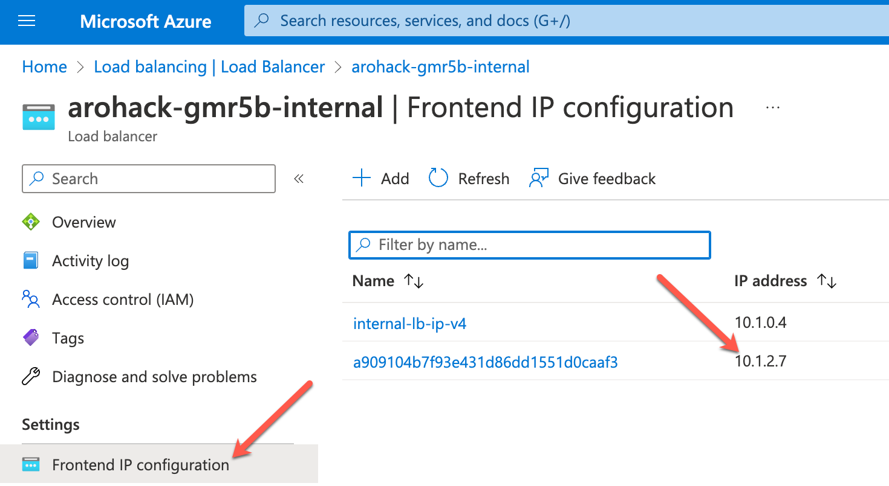
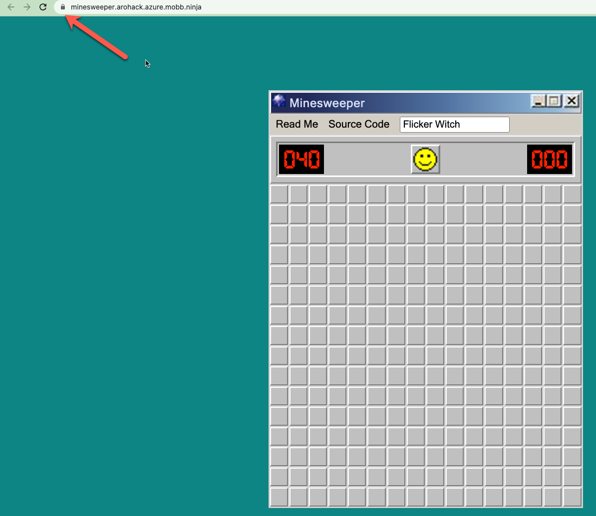

# Deploy and Expose an Application ( Part 2)

## Expose the application with Front Door
Up to this point, we have deployed the minesweeper app using the publicly available Ingress Controller that comes with OpenShift.

In the following section of the workshop, we will set up Azure Front Door and expose our minesweeper application with a custom domain over a private ingres controller.

Frontdoor to private cluster:


There are several advantages of this approach:

* ARO cluster and all the resources in your Azure account can be private.
* Azure FrontDoor operates at the edge so we are controlling traffic before it gets into your Azure account. 
* Azure FrontDoor offers WAF and DDoS protection, certificate management and SSL Offloading just to name a few benefits.

As you can see in the diagram, Azure Front Door sits on the edge of the Microsoft network and is connected to the cluster via a private link service.

<todo>
Setting up and configuring Azure Front Door for the minesweeper application is typically something the operations team would do.  If you are interested in going through the steps, you can do so [here](../ops/6-front-door.md)  
<todo>

## Verify the private Ingress Controller
This workshop uses a public cluster where the API and default Applications endpoints are exposed to the Internet.  To simulate a private environment for the applications endpoint, a second Ingress Controller only exposed to the private network of our cluster has been created for you.


Let's check to make sure the IngressController has been created.

```bash
oc get IngressController -n openshift-ingress-operator
```

Expected output, you should see a 2nd private IngressController:


Now, check that the corresponding LoadBalancer service has been created.

```bash
oc get svc -n openshift-ingress
```

The output of this command should show that a route-internal-private and a router-private LoadBalancer service has been created.  Note that there are no public IPs associated with the newly created LoadBalancer services.

Expected Output:


**Extra Credit**<br>

Validate the Load Balancer using the Azure Portal.

From the Azure Portal, search for Load Balancers and then click on the \<cluster name -  id\>-internal Load Balancer


On the next screen click on Frontend IP configuration and note the IP address matches the LoadBalancer service you just retrieved with the CLI.



## Configure the application to use Front Door
Your operations team has already configured Front Door for you with a custom domain so now we can configure the application to use Azure Front Door and your custom domain.

**Create new route**

All we have to do is create a new route with our custom domain:

```bash
envsubst << EOF | oc apply -f -
apiVersion: route.openshift.io/v1
kind: Route
metadata:
  labels:
    app.kubernetes.io/name: microsweeper-appservice
    app.kubernetes.io/version: 1.0.0-SNAPSHOT
    app.openshift.io/runtime: quarkus
    type: private
  name: microsweeper-appservice-fd
spec:
  host: $ARO_APP_FQDN
  tls:
    termination: edge
    insecureEdgeTerminationPolicy: Redirect
  to:
    kind: Service
    name: microsweeper-appservice
    weight: 100
    targetPort:
      port: 8080
  wildcardPolicy: None
EOF
```

**Validate the Custom Domain**
From the OpenShift Console, click on Networking, Routes and then click on the url next to the newly create microsweeper-appservice-fd route.


Notice that the application is secured! This is done automatically for us by Front Door.


The last thing we will validate it where is your custom domain coming from.  If you remember, one of the benefits of using Azure Front Door is that traffic is sent through and secured at the Microsoft edge rather than your application.

To check where the traffic is coming from run the following command from your cloudshell:

```bash 
nslookup minesweeper.arohack.azure.mobb.ninja
```

Notice how the results show traffic coming from *.t-msedge.net


Congratulations, you now have an application exposed with Front Door using a custom domain.
Continue to [Part 3](2C-deploy-app.md) of Deploy and Expose an App to automate provisioning the application using OpenShift Pipelines.
