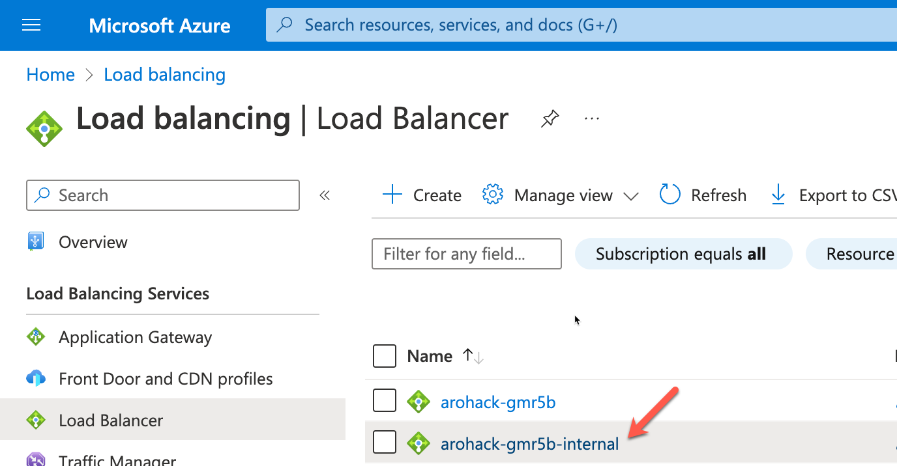

# Deploy and Expose an Application ( Part 2)

## Expose the application with Front Door
Up to this point, we have deployed the minesweeper app using the publically available Ingress Controller that comes with OpenShift.  Best practices for ARO clusters is to make them private ( both the api server and the ingress controller) and then exposing the application you need with something like Azure Front Door.

In the following section of the workshop, we will go through setting up Azure Front Door and then exposing our minesweeper application with Azure Front Door using a custom domain.

The following diagram shows what we will configure.


There are several advantages of this approach, namely your cluster and all the resources in your Azure account can remain private, providing you an extra layer of security. Azure FrontDoor operates at the edge so we are controlling traffic before it even gets into your Azure account. On top of that, Azure FrontDoor also offers WAF and DDoS protection, certificate management and SSL Offloading just to name a few benefits.

As you can see in the diagram, Azure Front Door sits on the edge of the Microsoft network and is connected to the cluster via a private link service.  With a private cluster, this means all traffic goes through Front Door and is secured at the edge.  Front Door is then connected to your cluster through a private connection over the Microsoft backbone.

Setting up and configuring Azure Front Door for the minesweeper application is typically something the operations team would do.  If you are interested in going through the steps, you can do so [here](../ops/6-front-door.md)  

## Create a private Ingress Controller
As you will remember in Part 1, this workshop uses a public cluster where the API and default Applications endpoints are exposed to the Internet.  To similar a private environment for the applications endpoint, we will craete a second Ingress Controller only exposed to the private network of our cluster.

Start by gathering a couple envionment variables from the default IngressController.

```bash
export INGRESSCERT=$(oc get IngressController default -n openshift-ingress-operator -o jsonpath='{.spec.defaultCertificate.name}')

export SELECTOR=ingresscontroller.operator.openshift.io/deployment-ingresscontroller=private

export DOMAIN=$(oc get IngressController default -n openshift-ingress-operator -o jsonpath='{.status.domain}' | sed "s/apps/apps2/g")
```

Now apply the following yaml file that will create a 2nd 'private' Ingress Controller.

``` bash
envsubst << EOF | oc apply -f -
apiVersion: v1
items:
- apiVersion: operator.openshift.io/v1
  kind: IngressController
  metadata:
    finalizers:
    - ingresscontroller.operator.openshift.io/finalizer-ingresscontroller
    generation: 2
    name: private
    namespace: openshift-ingress-operator
  spec:
    clientTLS:
      clientCA:
        name: ""
      clientCertificatePolicy: ""
    defaultCertificate:
      name: $INGRESSCERT
    httpCompression: {}
    httpEmptyRequestsPolicy: Respond
    httpErrorCodePages:
      name: ""
    replicas: 2
    tuningOptions: {}
    domain: $DOMAIN
    endpointPublishingStrategy:
      loadBalancer:
        scope: Internal
      type: LoadBalancerService
    observedGeneration: 2
    selector: $SELECTOR
    tlsProfile:
      ciphers:
      - ECDHE-ECDSA-AES128-GCM-SHA256
      - ECDHE-RSA-AES128-GCM-SHA256
      - ECDHE-ECDSA-AES256-GCM-SHA384
      - ECDHE-RSA-AES256-GCM-SHA384
      - ECDHE-ECDSA-CHACHA20-POLY1305
      - ECDHE-RSA-CHACHA20-POLY1305
      - DHE-RSA-AES128-GCM-SHA256
      - DHE-RSA-AES256-GCM-SHA384
      - TLS_AES_128_GCM_SHA256
      - TLS_AES_256_GCM_SHA384
      - TLS_CHACHA20_POLY1305_SHA256
      minTLSVersion: VersionTLS12
kind: List
EOF
```

Let's check to make sure the IngressController has been created.

```bash
oc get IngressController -n openshift-ingress-operator
```

Expected output, you should see a 2nd private IngressController:


Now, check that the corresponding LoadBalancer service has been created.

```bash
oc get svc -n openshift-ingress
```

The output of this command should show that a route-internal-private and a router-private LoadBalancer service has been created.  Note that there are no public IPs associated with the newly created LoadBalancer services.

Expected Output:


**Extra Credit**
Validate the Load Balancer using the Azure Portal.

From the Azure Portal, search for Load Balancers and then click on the /<cluster name -  id/>-internal Load Balancer


On the next screen click on Frontend IP configuration and note the IP address matches the LoadBalancer service you just retrieved with the CLI.


## Configure the application to use Front Door
Now that front door has been configured and we have a custom domain pointing to our application, we can now configure the application to use Azure Front Door and your custom domain.

The first thing we need to do is delete the route that is connecting directly to our cluster.

```bash
oc delete route microsweeper-appservice
```

Next, we create a new route that points to our application.

Create new route

```bash
cat << EOF | oc apply -f -
apiVersion: route.openshift.io/v1
kind: Route
metadata:
  labels:
    app.kubernetes.io/name: microsweeper-appservice
    app.kubernetes.io/version: 1.0.0-SNAPSHOT
    app.openshift.io/runtime: quarkus
    type: private
  name: microsweeper-appservice-fd
spec:
  host: $ARO_APP_FQDN
  to:
    kind: Service
    name: microsweeper-appservice
    weight: 100
    targetPort:
      port: 8080
  wildcardPolicy: None
EOF
```
