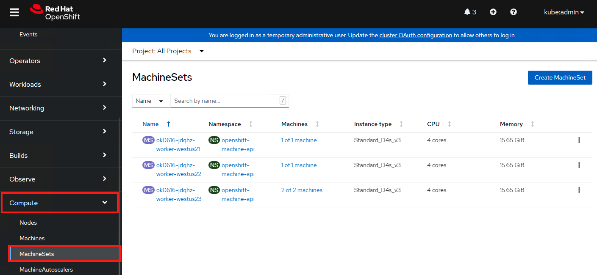

## Introduction

There may be times when you need to change aspects of your worker nodes. Things like scaling, changing the type, adding labels or taints to name a few. Most of these things are done through the use of machine sets. A machine is a unit that describes the host for a node and a machine set is a group of machines. Think of a machine set as a “template” for the kinds of machines that make up the worker nodes of your cluster. Similar to how a replicaset is to pods. A machine set allows users to manage many machines as a single entity though it is contained to a specific availability zone. If you'd like to learn more see [Overview of machine management](https://docs.openshift.com/container-platform/latest/machine_management/index.html)

## Scaling worker nodes

### View the machine sets that are in the cluster

Let's see which machine sets we have in our cluster.  If you are following this lab, you should only have three so far (one for each availability zone).

From the terminal run:

```bash
oc -n openshift-machine-api get machinesets
```

You will see a response like:

```{ .text .no-copy}
NAME                           DESIRED   CURRENT   READY   AVAILABLE   AGE
ok0620-rq5tl-worker-westus21   1         1         1       1           72m
ok0620-rq5tl-worker-westus22   1         1         1       1           72m
ok0620-rq5tl-worker-westus23   1         1         1       1           72m
```
This is telling us that there is a machine set defined for each availability zone in westus2 and that each has one machine.

### View the machines that are in the cluster

Let's see which machines (nodes) we have in our cluster.

From the terminal run:

```bash
oc -n openshift-machine-api get machine
```

You will see a response like:

```{ .text .no-copy}
NAME                                 PHASE     TYPE              REGION    ZONE   AGE
ok0620-rq5tl-master-0                Running   Standard_D8s_v3   westus2   1      73m
ok0620-rq5tl-master-1                Running   Standard_D8s_v3   westus2   2      73m
ok0620-rq5tl-master-2                Running   Standard_D8s_v3   westus2   3      73m
ok0620-rq5tl-worker-westus21-n6lcs   Running   Standard_D4s_v3   westus2   1      73m
ok0620-rq5tl-worker-westus22-ggcmv   Running   Standard_D4s_v3   westus2   2      73m
ok0620-rq5tl-worker-westus23-hzggb   Running   Standard_D4s_v3   westus2   3      73m
```

As you can see we have 3 master nodes, 3 worker nodes, the types of nodes, and which region/zone they are in.

### Scale the number of nodes up via the CLI

Now that we know that we have 3 worker nodes, let's scale the cluster up to have 4 worker nodes. We can accomplish this through the CLI or through the OpenShift Web Console. We'll explore both.

From the terminal run the following to imperatively scale up a machine set to 2 worker nodes for a total of 4.

!!! info
    Remember that each machine set is tied to an availability zone so with 3 machine sets with 1 machine each, in order to get to a TOTAL of 4 nodes we need to select one of the machine sets to scale up to 2 machines.

```bash
MACHINE_SET=$(oc -n openshift-machine-api get machinesets -o name | head -1)
oc -n openshift-machine-api scale --replicas=2 "${MACHINE_SET}"
```

View the machine set

```bash
oc -n openshift-machine-api get machinesets
```

You will now see that the desired number of machines in the machine set we scaled is "2".

```{ .text .no-copy}
NAME                           DESIRED   CURRENT   READY   AVAILABLE   AGE
ok0620-rq5tl-worker-westus1   2         2         1       1           73m
ok0620-rq5tl-worker-westus2   1         1         1       1           73m
ok0620-rq5tl-worker-westus3   1         1         1       1           73m
```

If we check the machines in the clusters

```bash
oc -n openshift-machine-api get machines \
  -l "machine.openshift.io/cluster-api-machine-role=worker"
```

You will see that one is in the "Provisioned" phase (and in the zone of the machineset we scaled) and will shortly be in "running" phase.

```{ .text .no-copy}
NAME                                 PHASE         TYPE              REGION    ZONE   AGE
ok0620-rq5tl-worker-westus21-n6lcs   Running       Standard_D4s_v3   westus2   1      74m
ok0620-rq5tl-worker-westus22-ggcmv   Running       Standard_D4s_v3   westus2   2      74m
ok0620-rq5tl-worker-westus23-5fhm5   Provisioned   Standard_D4s_v3   westus2   3      54s
ok0620-rq5tl-worker-westus23-hzggb   Running       Standard_D4s_v3   westus2   3      74m
```

### Scale the number of nodes down via the Web Console

Now let's scale the cluster back down to a total of 3 worker nodes, but this time, from the web console. (If you need the URL or credentials in order to access it please go back to the relevant portion of Lab 1)

Access your OpenShift web console, if you need help remembering the URL or credentials you can run

```bash
env | grep OCP_
```

Expand "Compute" in the left menu and then click on "MachineSets"



In the main pane you will see the same information about the machine sets from the command line.  Now click on the "three dots" at the end of the line for the machine set that you scaled up to "2". Select "Edit machine count" and decrease it to "1". Click save.


This will now decrease that machine set to only have one machine in it.
