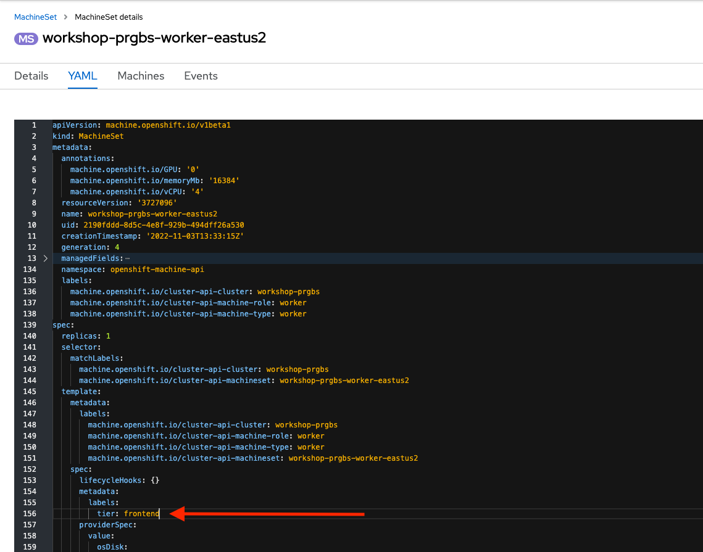

## Introduction

To add a node label it is recommended to set the label in the machine set. While you can directly add a label the node, this is not recommended since nodes could be overwritten and then the label would disappear.  Once the machine set is modified to contain the desired label any new machines created from that set would have the newly added labels.  This means that existing machines (nodes) will not get the label.  Therefore, to make sure all nodes have the label, you should scale the machine set down to zero and then scale the machine set back up.

Labels are a useful way to select which nodes / machine sets that an application will run on. If you have a memory intensitve application, you may choose to use a memory heavy node type to place that application on. By using labels on the machinesets and selectors on your pod / deployment specification, you ensure thats where the application lands.
oc get pods

### Use the Web Console to Label Nodes

Select "MachineSets" from the left menu.  You will see the list of machinesets.

We'll select the first one "ok0620-rq5tl-worker-westus21"

Click on the second tab "YAML"

Click into the YAML and under `spec.template.metadata.labels` add a key:value pair for the label you want.  In our example we can add a label "tier: frontend". Click Save.

The already existing machine won't get this label but any new machines will.  So to ensure that all machines get the label, we will scale down this machine set to zero, then once completed we will scale it back up as we did earlier.

Click on the machine that was just created.

You can see that the label is now there.

