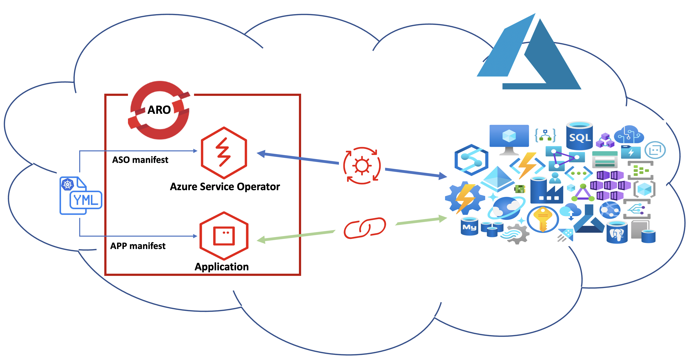

## Deploy Azure Service Operator
Azure Service Operator (ASO) is an open-source project by Microsoft Azure. ASO gives you the ability to provision and manage Azure resources such as compute, databases, resource groups, networking, etc. as objects in Kubernetes using declarative Kubernetes manifests.

ASO consists of:
- Custom Resource Definitions (CRDs) for each of the Azure services that a Kubernetes user can provision.
- A Kubernetes controller that manages the Azure resources represented by the user-specified Custom Resources. The controller attempts to synchronize the desired state in the user-specified Custom Resource with the actual state of that resource in Azure, creating it if it doesn't exist, updating it if it has been changed, or deleting it.




We deploy ASO on an ARO cluster to provision and manage Azure resources. To install ASO we need:

- An Azure Service Principal with Contributor permissions in the Azure Subscription. An Azure service principal is an identity created for use with applications, hosted services, and automated tools to access Azure resources.
  - This will be provided to you by the event staff
- A cert-manager operator instance

###  Install and run ASO on your ARO cluster

#### Prepare your environment
First, set the required environment variables for your environment, be sure to replace the ClientID and Client Secret with the values you were provided:
 
 ```bash
 AZURE_TENANT_ID="$(az account show -o tsv --query tenantId)"
 echo "Azure Tenant ID $AZURE_TENANT_ID"
 AZURE_SUBSCRIPTION_ID="$(az account show -o tsv --query id)"
 echo "Azure subscription ID $AZURE_SUBSCRIPTION_ID"
 AZURE_CLIENT_ID=<your-client-id> # This is the appID from the service principal provided to you.
 AZURE_CLIENT_SECRET=<your-client-secret> # This is the password from the service principal we created.

 ```

Next, create a Kubernetes Secret object that contains the environment variables from the previous step:

```bash
cat <<EOF | oc apply -f - 
apiVersion: v1
kind: Secret
metadata:
  name: azureoperatorsettings
  namespace: openshift-operators
stringData:
  AZURE_TENANT_ID: $AZURE_TENANT_ID
  AZURE_SUBSCRIPTION_ID: $AZURE_SUBSCRIPTION_ID
  AZURE_CLIENT_ID: $AZURE_CLIENT_ID
  AZURE_CLIENT_SECRET: $AZURE_CLIENT_SECRET
#  AZURE_CLOUD_ENV: AzureCloud
EOF
```

#### Install Cert Manager Operator

The cert-manager operator can be installed by following these steps:

Create a Namespace for cert-manager-operator:

```bash
cat <<EOF | oc apply -f -
kind: Namespace
apiVersion: v1
metadata:
  name: openshift-cert-manager-operator
EOF
```

Create an operator group. An Operator group, defined by the OperatorGroup resource, provides multi-tenant configuration to Operators:

```bash
cat <<EOF | oc apply -f -
apiVersion: operators.coreos.com/v1
kind: OperatorGroup
metadata:
  name: openshift-cert-manager-operator-group
  namespace: openshift-cert-manager-operator
spec: {}  
EOF
```

Create a subscription to the OpenShift Marketplace:

```bash
cat <<EOF | oc apply -f -
apiVersion: operators.coreos.com/v1alpha1
kind: Subscription
metadata:
  name: openshift-cert-manager-operator
  namespace: openshift-cert-manager-operator
spec:
  channel: tech-preview
  installPlanApproval: Automatic
  name: openshift-cert-manager-operator
  source: redhat-operators
  sourceNamespace: openshift-marketplace
  startingCSV: openshift-cert-manager.v1.7.1
EOF
```

Wait for the cert-manager Operator to be ready:

```bash
while [[ $(oc get pods -l app=cert-manager -n openshift-cert-manager -o 'jsonpath={..status.conditions[?(@.type=="Ready")].status}') != "True" ]]; do echo "waiting for cert-manager pod" && sleep 1; done
while [[ $(oc get pods -l app=webhook -n openshift-cert-manager -o 'jsonpath={..status.conditions[?(@.type=="Ready")].status}') != "True" ]]; do echo "waiting for cert-manager webhook pod" && sleep 1; done
```

#### Install the latest ASOv2 Helm Chart

```bash
helm repo add aso2 https://raw.githubusercontent.com/Azure/azure-service-operator/main/v2/charts
helm upgrade --install --devel aso2 aso2/azure-service-operator \
     --create-namespace \
     --namespace=azureserviceoperator-system \
     --set azureSubscriptionID=$AZURE_SUBSCRIPTION_ID \
     --set azureTenantID=$AZURE_TENANT_ID \
     --set azureClientID=$AZURE_CLIENT_ID \
     --set azureClientSecret=$AZURE_CLIENT_SECRET
```
   
!!! info
    It takes up to 5 min for ASO operator to be up and running

There is a pod in the azureserviceoperator-system namespace with two containers, when both are running the controller is installed and ready:

```bash
oc get po -n azureserviceoperator-system
```

```bash
NAME                                                READY   STATUS    RESTARTS   AGE
azureserviceoperator-controller-manager-5b4bfc59df-lfpqf   2/2     Running   0          24s
```
