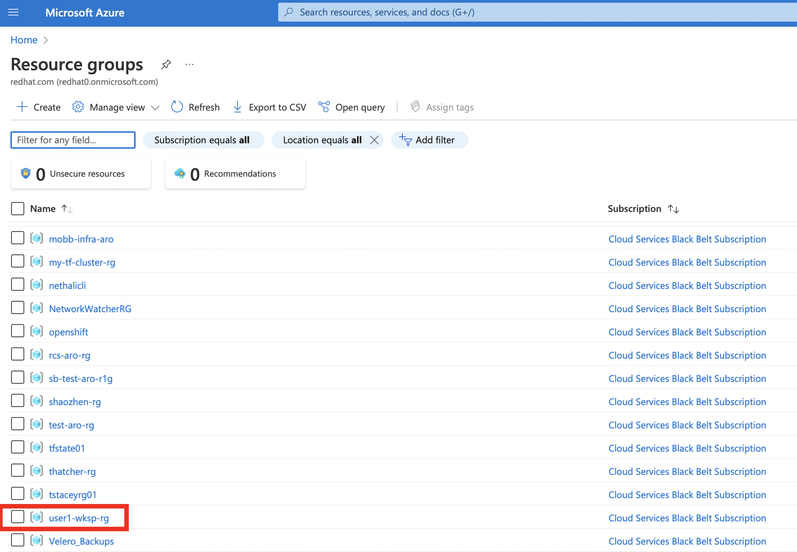

## Deploy Database for Minesweeper application through ASO
Azure Service Operator(ASO) is an open-source project by Microsoft Azure. ASO gives you the ability to provision and manages Azure resources such as compute, databases, resoure group, vnet, subnet,... within the Kubernetes plane by using familiar Kubernetes tooling and primitives. ASO consists of:
1. Custom Resource Definitions (CRDs) for each of the Azure services that a Kubernetes user can provision.
1. A Kubernetes controller that manages the Azure resources represented by the user-specified Custom Resources. The controller attempts to synchronize the desired state in the user-specified Custom Resource with the actual state of that resource in Azure, creating it if it doesn't exist, updating it if it has been changed, or deleting it.

In this task, we use ASO to provision a PostgreSQL DB and connect applications to Azure resources from within Kubernetes

### Prerequisites

* an ARO cluster
* oc cli
* Azure Service Operator(ASO) operator v2
* optional: client tool for Postgres - psql , pgadmin
  
## Provision DB for Minesweeper APP

to provision a PostgreSQL DB you need to create the following objects in your cluster:
 - ResourceGroup  
 - FlexibleServer  
 - FlexibleServersDatabase 
 - FlexibleServersFirewallRule

1. **ResourceGroup**  **(if you don't have Resource Group)**
    ```bash
    cat <<EOF | oc apply -f -
    apiVersion: resources.azure.com/v1beta20200601
    kind: ResourceGroup
    metadata:
      name: user1-wksp-rg
      namespace: default
    spec:
      location: eastus
    EOF
    ```

    check resource group in Azure portal 
    

2. **Provision PostgreSQL flexible server**

    1. **Create a secret for the DB server**
      
        **NOTE: You can update password in base64 format**
       
        ```bash
        cat <<EOF | oc apply -f -
        apiVersion : v1
        kind : Secret
        metadata : 
          name : server-admin-pw
          namespace : default
        data:
          password: cjNkaDR0MSE=
        type: Opaque
        EOF
        ```
            
    2. **Create DB server**
      
        ```bash
        cat <<EOF | oc apply -f -
        apiVersion: dbforpostgresql.azure.com/v1beta20210601
        kind: FlexibleServer
        metadata:
          name: user1-minesweeper-database
          namespace: default
        spec:
          location: eastus
          owner:
            name: user1-wksp-rg
          version: "13"
          sku:
            name: Standard_B1ms
            tier: Burstable
          administratorLogin: myAdmin
          administratorLoginPassword: # This is the name/key of a Kubernetes secret in the same namespace
            name: server-admin-pw
            key: password
          storage:
            storageSizeGB: 32
        EOF
        ```
      
    3. **Create Server configuration**
        ```bash
        cat  <<EOF | oc apply -f -
        apiVersion: dbforpostgresql.azure.com/v1beta20210601
        kind: FlexibleServersConfiguration
        metadata:
          name: pgaudit
          namespace: default
        spec:
          owner:
            name: user1-minesweeper-database
          azureName: pgaudit.log
          source: user-override
          value: READ
        EOF
        ```
    4.  **Create a firewall rule for the database**
        ```bash
        cat  <<EOF | oc apply -f -
        apiVersion: dbforpostgresql.azure.com/v1beta20210601
        kind: FlexibleServersFirewallRule
        metadata:
          name: wksp-fw-rule
          namespace: default
        spec:
          owner:
            name: user1-minesweeper-database
          startIpAddress: 0.0.0.0
          endIpAddress: 255.255.255.255
        EOF
        ```
 
**Note: it takes about 10 minutes for the database to be operational and running** 

 
1. **Create a sample DB**
    ```bash
    cat  <<EOF | oc apply -f -
    apiVersion: dbforpostgresql.azure.com/v1beta20210601
    kind: FlexibleServersDatabase
    metadata:
      name: score
      namespace: default
    spec:
      owner:
        name: user1-minesweeper-database
      charset: utf8
    
    EOF
    ```


1. **check provisioning is done**
    ```bash
    while [ $(oc get flexibleservers.dbforpostgresql.azure.com user1-minesweeper-database -o json | jq -r .status.conditions[0].status) != True ]; do  date; echo "wait";  sleep 10; done
    ```

    check server in Azure portal
       

1. **Check connection to DB server**
    ```bash
    psql "host=user1-minesweeper-database.postgres.database.azure.com port=5432 dbname=score user=myAdmin password=r3dh4t1! sslmode=require"
    ```


