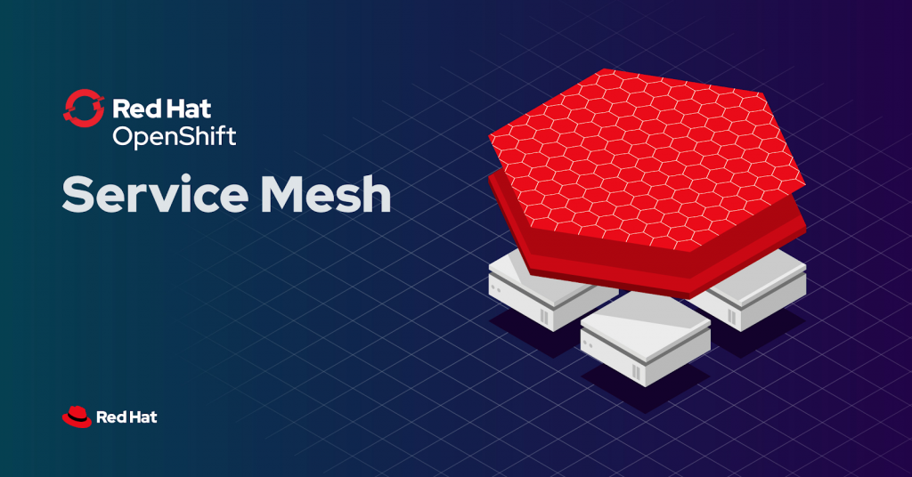
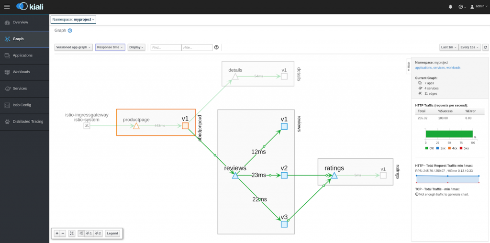

# Red Hat Service Mesh

## What is Red Hat Service Mesh?
As your applications evolve into collections of decentralized microservices, monitoring and managing the network communications and security among those multiple services becomes more challenging.

Red Hat OpenShift Service Mesh—based on the open source project Istio —provides a uniform way to connect, manage, and observe microservices-based applications. It provides behavioral insight into—and control of—the networked microservices in your service mesh.

## Why Redhat Service Mesh?
Applications are changing from monoliths into collections of small, independent, and loosely coupled services often referred to as cloud-native applications. These services are organized in a microservices architecture.

Managing the communication between different services, and analyzing and maintaining security, can be a challenge. This can be greatly simplified and optimized by using a service mesh to route requests from one service to another, and optimizing how the different services work with one another.

With Red Hat OpenShift Service Mesh, you get a uniform way to connect, manage, and observe your microservices, without requiring you to redesign your application. As your containers and services evolve, Service Mesh allows you control of—the networked microservices through the use of a sidecar proxy that intercepts network communication between microservices. OpenShift Service Mesh provides integrated metrics, logging, and tracing, traditionally available only deep within the application or service.
## Redhat Service Mesh Benefits

### Ready for production
Installs easily on Red Hat OpenShift, the hybrid cloud enterprise Kubernetes platform trusted by thousands of organizations around the globe.
Red Hat OpenShift Service Mesh is pre-validated and fully supported to work on Red Hat OpenShift, straight out of the box.

### Security-focused
Red Hat OpenShift Service Mesh provides comprehensive application networking security. This is achieved through transparent mTLS encryption and fine-grained policies that facilitate zero-trust networking.

### Based on open source
Based on the open source Istio project, Red Hat OpenShift Service Mesh provides additional functionality with the inclusion of other open source projects like Kiali (Istio console) and Jaeger (distributed tracing), which supports collaboration with leading members of the Istio community.
## Use Cases

### Connect
* Connect Traffic Flow
* Blue/Green Deployments
* Circut Breaking
* Virtual Services
### Secure
* Data-in-transit Encryption
* Authentication
* Authorization
* Secure Naming
### Control
* Configuration
* Apply/Enforce Policies
* Fair Resource Distribution
### Observe
* Layer 7 Visibility
* Monitoring
* Logging
* Distributed Tracing
## Difference Bewteen Istio
* OpenShift Service Mesh installs a multi-tenant control plane by default
* OpenShift Service Mesh extends Role Based Access Control (RBAC) features
* OpenShift Service Mesh replaces BoringSSL with OpenSSL
* Kiali and Jaeger are enabled by default in OpenShift Service Mesh
## What is th advantage of choosing Red Hat Service Mesh?
Red Hat helps you get started faster because OpenShift Service Mesh is engineered to be ready for production. With OpenShift Service Mesh developers can increase productivity by integrating communication policies without changing application code or integrating language-specific libraries. OpenShift Service Mesh can also make things easier for operations because it installs easily on Red Hat OpenShift, has been tested with other Red Hat products, and comes with access to award-winning support. 
