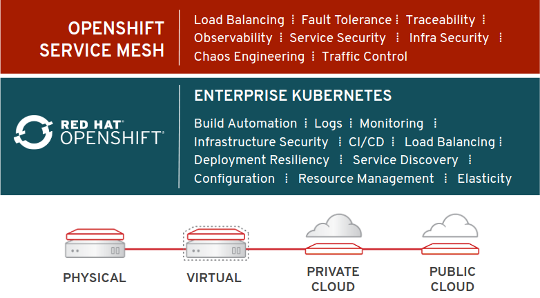

# Red Hat Service Mesh

## What is Red Hat Service Mesh?
Applications are changing from monoliths into collections of small, independent, and loosely coupled services often referred to as cloud-native applications. These services are organized in a microservices architecture.

Managing the communication between different services, and analyzing and maintaining security, can be a challenge. This can be greatly simplified and optimized by using a service mesh to route requests from one service to another, and optimizing how the different services work with one another.

With Red Hat OpenShift Service Mesh, you get a uniform way to connect, manage, and observe your microservices, without requiring you to redesign your application. As your containers and services evolve, Service Mesh allows you control of—the networked microservices through the use of a sidecar proxy that intercepts network communication between microservices. OpenShift Service Mesh provides integrated metrics, logging, and tracing, traditionally available only deep within the application or service. 

## Why Redhat Service Mesh?

## Redhat Service Mesh Benefits
## Difference Bewteen Istio
## What is th advantage of choosing Red Hat Service Mesh?
