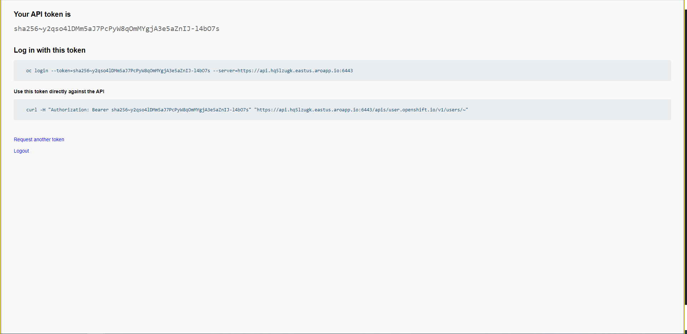

# [Red Hat OpenShift Service Mesh](https://docs.openshift.com/container-platform/4.11/service_mesh/v1x/ossm-architecture.html)

Based on the open source Istio project, Red Hat OpenShift Service Mesh adds a transparent layer on existing distributed applications without requiring any changes to the service code. You add Red Hat OpenShift Service Mesh support to services by deploying a special sidecar proxy to relevant services in the mesh that intercepts all network communication between microservices. You configure and manage the Service Mesh using the Service Mesh control plane features.

### oc login

1. **Click Dropdown**

1. **Click Display Token**

1. **Copy oc login command into terminal**


## Deploy control plane

1. Log in to the OpenShift Container Platform CLI

```bash
 oc login https://<HOSTNAME>:6443
```

2. Create a project named istio-system.

```bash
oc new-project istio-system
```
3. Create a ServiceMeshControlPlane file named istio-installation.yaml

  ***Example version 2.2 istio-installation.yaml***
```bash
apiVersion: maistra.io/v2
kind: ServiceMeshControlPlane
metadata:
  name: basic
  namespace: istio-system
spec:
  version: v2.2
  tracing:
    type: Jaeger
    sampling: 10000
  addons:
    jaeger:
      name: jaeger
      install:
        storage:
          type: Memory
    kiali:
      enabled: true
      name: kiali
    grafana:
      enabled: true
```
4. Run the following command to deploy the Service Mesh control plane

```bash
oc create -n istio-system -f https://raw.githubusercontent.com/rh-mobb/aro-hackathon-content/main/aro-content/assets/istio_installation.yaml
```
5. To watch the progress of the pod deployment, run the following command:

```
oc get pods -n istio-system -w

```
You should see output similar to the following:
```
NAME                                   READY   STATUS    RESTARTS   AGE
grafana-b4d59bd7-mrgbr                 2/2     Running   0          65m
istio-egressgateway-678dc97b4c-wrjkp   1/1     Running   0          108s
istio-ingressgateway-b45c9d54d-4qg6n   1/1     Running   0          108s
istiod-basic-55d78bbbcd-j5556          1/1     Running   0          108s
jaeger-67c75bd6dc-jv6k6                2/2     Running   0          65m
kiali-6476c7656c-x5msp                 1/1     Running   0          43m
prometheus-58954b8d6b-m5std            2/2     Running   0          66m
wasm-cacher-basic-8c986c75-vj2cd       1/1     Running   0          65m
```

### Validating your SMCP installation with the CLI
  
6. Run the following command to verify the Service Mesh control plane installation, where istio-system is the namespace where you installed the Service Mesh control plane.
  
```bash
oc get smcp -n istio-system
```

The installation has finished successfully when the STATUS column is ComponentsReady

```bash
NAME    READY   STATUS            PROFILES      VERSION   AGE
basic   10/10   ComponentsReady   ["default"]   2.1.1     66m  
````
