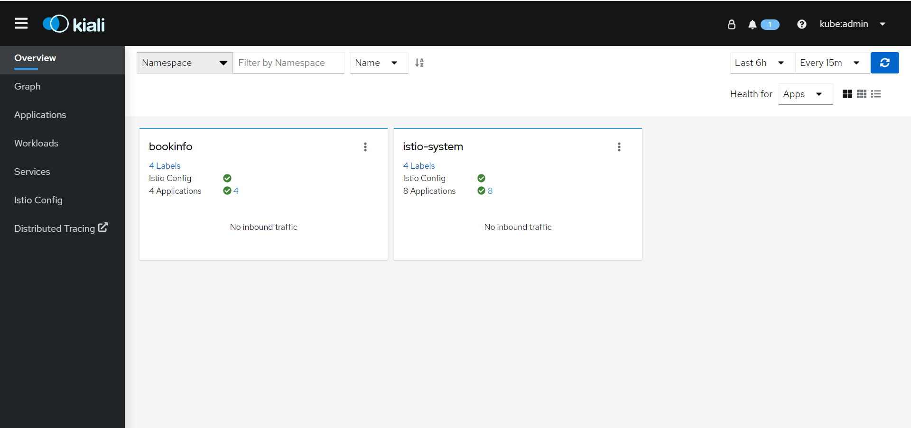
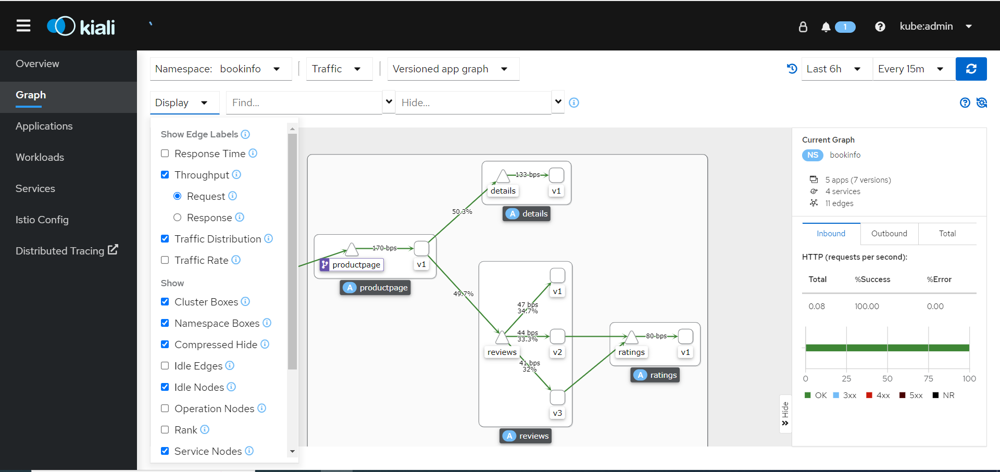

## Kiali Web Console
### Obtain the address for the Kiali web console.
***Under Mesh Project***

1. **Login** to the OpenShift Container Platform web console as a user with cluster-admin rights. If you use Red Hat OpenShift Dedicated, you must have an account with the dedicated-admin role.

1. **Navigate** to project to Networking → Routes.

1. On the Routes page, select the Service Mesh control plane project, for example istio-system, from the Namespace menu.


1. The Location column displays the linked address for each route.

1. **Click** the link in the Location column for Kiali.

1. **Click Login With OpenShift**. The Kiali Overview screen presents tiles for each project namespace.


1. Use Cluster Credentials to login.
```bash
 az aro list-credentials \
   --name $AZR_CLUSTER \
   --resource-group $AZR_RESOURCE_GROUP \
   -o tsv
```
1. **Refresh URL** atleast 10 times in the browser to generate traffic for your graph.


1. Kiali Console.


1. **Change** Time Settings to **Last 6 hours and Every 15 minutes.**


1. In Kiali, **click Graph.**

1. **Select** bookinfo from the Namespace list, and App graph from the Graph Type list.


1. **Click** Display idle nodes from the Display menu.


1. **View** Graph and change display settings to add or remove information from the graph.


1. **Click Workload tab**
1. **Select Details Workload**


